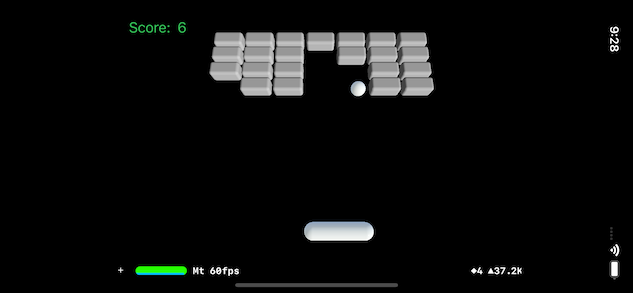

# WSUBreak3D

An Xcode12 project for iOS that implements a simple "Break Out" game in 3D in SceneKit. This project was created in Wright State University CS-3170 "Mobile Apps" class during the last week of October 2021 as a demonstration of SceneKit, 3D, and physics with very little code.

- SceneKit
- Camera and Lights
- Physics
- GestureRecognizer
- UIKit
- DispatchQueue for updates on the main thread

